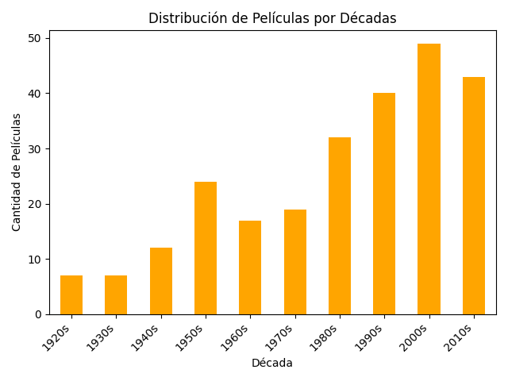

# 🎬 IMDb ETL Project

Pipeline ETL para análisis de datos de IMDb con Python. Este proyecto muestra cómo extraer, transformar y cargar datos para obtener insights sobre las 250 películas mejor calificadas según IMDb.


## 📋 Estructura del Proyecto

IMDb_ETL_Project/

├── data/

│   └── imdb_top_250.csv                 # Archivo con los datos originales.

├── notebooks/

│   └── Peliculas.ipynb                  # Notebook Jupyter con todo el pipeline ETL.

├── output/

│   ├── movies_transformed.csv           # Datos transformados en formato CSV.

│   ├── movies.db                        # Base de datos SQLite con los datos enriquecidos.

│   └── visualizations/                  # Carpeta para gráficos generados.

│       ├── top_10_movies.png            # Visualización del Top 10.

│       ├── movies_by_decade.png         # Distribución por décadas.

│       ├── votes_vs_rating.png          # Relación entre calificación y votos.

│       └── ratings_distribution.png     # Distribución de calificaciones IMDb.

├── requirements.txt                     # Dependencias del proyecto.

├── LICENSE                              # Archivo de licencia del proyecto.

└── README.md                            # Descripción del proyecto.


## 📊 Descripción del Pipeline ETL
1. Extract (Extracción):
Los datos fueron extraídos desde el archivo imdb_top_250.csv proporcionado en la carpeta data/.
2. Transform (Transformación):
Limpieza de datos:
Eliminación de duplicados.
Conversión de la columna Duration a minutos y horas.
Enriquecimiento de datos:
Clasificación por décadas.
Categorización de calidad de películas basada en su calificación IMDb.
Conversión de votos a un formato más legible (en millones).
3. Load (Carga):
Los datos transformados se almacenaron en:
movies_transformed.csv en la carpeta output/.
Una base de datos SQLite (movies.db) para facilitar consultas.

https://nbviewer.org/github/AnnieGeek/IMDb_ETL_Project./blob/main/notebooks/Peliculas.ipynb


## 📈 Visualizaciones
Se generaron las siguientes visualizaciones:

1. Top 10 películas mejor calificadas:
Archivo: output/visualizations/top_10_movies.png
Muestra las 10 películas con mejores calificaciones en IMDb.
2. Distribución de películas por década:
Archivo: output/visualizations/movies_by_decade.png
Analiza cuántas películas por década forman parte del Top 250.
3. Relación entre calificaciones IMDb y votos:
Archivo: output/visualizations/votes_vs_rating.png
Explora la relación entre las calificaciones y la popularidad (medida por número de votos).
4. Distribución de calificaciones IMDb:
Archivo: output/visualizations/ratings_distribution.png
Muestra cómo se distribuyen las calificaciones entre las películas del Top 250.




## 🛠️ Herramientas Utilizadas
**Librerías de Python:**
pandas: Procesamiento y manipulación de datos.

matplotlib: Creación de gráficos y visualizaciones.

sqlite3: Manejo de bases de datos SQLite.

**Entorno:**
Jupyter Notebook: Desarrollo del pipeline ETL.

GitHub: Documentación y versionado del proyecto.

## 🖥️ Cómo Ejecutar el Proyecto

Sigue los pasos a continuación para configurar y ejecutar este proyecto en tu máquina local.

1. **Clona este repositorio**:
   Copia y pega el siguiente comando en tu terminal para clonar el repositorio y navegar al directorio del proyecto.
   ```bash
   git clone https://github.com/AnnieGeek/IMDb_ETL_Project.git
   cd IMDb_ETL_Project


2. Instala las dependencias: Asegúrate de tener Python instalado. Ejecuta este comando en tu terminal para instalar las dependencias necesarias:

              pip install -r requirements.txt
   
   Nota: El archivo requirements.txt incluye las librerías requeridas como:

pandas

matplotlib

sqlite3

os

re

3. **Abre el archivo Jupyter Notebook:**
   
            jupyter notebook notebooks/Peliculas.ipynb
   
4. **Explora los resultados:**
   
   Los datos procesados estarán en output/movies_transformed.csv y output/movies.db.
   
   Las visualizaciones estarán en la carpeta output/visualizations.

## 🤔 Conclusiones
Calificaciones Altas: Existe una correlación entre la cantidad de votos y las mejores calificaciones en IMDb.

Predominancia Histórica: Las décadas de los 1990 y 2000 tienen mayor representación en el Top 250.

Directores Destacados: Christopher Nolan y Steven Spielberg figuran como los directores con más películas en el Top 10.


## 📄 Licencia
Este proyecto está bajo la Licencia MIT. Consulta el archivo LICENSE para más detalles.


